# Multimodal Phishing Detection System — Pipeline Documentation

> Complete technical reference for FYP documentation. Covers architecture, every modality, the full training pipeline, all bugs encountered and their resolution, edge case testing, and the post-fusion correction layer.

---

## Table of Contents

1. [System Overview](#1-system-overview)
2. [High-Level Architecture](#2-high-level-architecture)
3. [Dataset — PhiUSIIL](#3-dataset--phiusiil)
4. [Modality 1 — URL Feature Extraction](#4-modality-1--url-feature-extraction)
5. [Modality 2 — DOM Analysis](#5-modality-2--dom-analysis)
6. [Modality 3 — Visual Analysis](#6-modality-3--visual-analysis)
7. [Fusion Model](#7-fusion-model)
8. [Inference Pipeline (End-to-End)](#8-inference-pipeline-end-to-end)
9. [Post-Fusion Correction Rules](#9-post-fusion-correction-rules)
10. [Explainability Layer (SHAP + Gemini)](#10-explainability-layer-shap--gemini)
11. [Training Pipeline](#11-training-pipeline)
12. [Bugs Encountered and Resolutions](#12-bugs-encountered-and-resolutions)
13. [Edge Case Testing Results](#13-edge-case-testing-results)
14. [Performance Summary](#14-performance-summary)

---

## 1. System Overview

The system detects phishing URLs using **three independent machine learning modalities** that each analyze a different signal:

| Modality | What It Analyzes | Model |
|----------|-----------------|-------|
| URL | Structure and character-level features of the URL string | LightGBM (15 features) |
| DOM | HTML structure of the fetched page | Doc2Vec + LightGBM |
| Visual | Screenshot of the rendered page | ResNet-50 CNN (fine-tuned) |

The outputs of these three models are combined by a **fusion meta-classifier** (LightGBM) that learns which combination of modality scores best predicts phishing. A **post-fusion correction layer** then applies rule-based overrides for known edge cases (OAuth portals, CMS login pages, DOM model spikes on unusual page structures).

---

## 2. High-Level Architecture

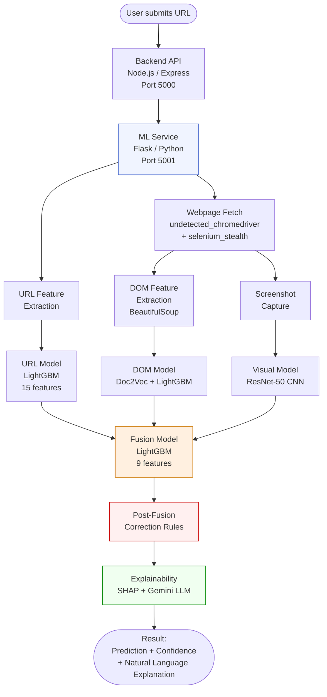

### Service Breakdown

- **Backend (`/backend_new`)** — Node.js/Express REST API. Receives scan requests from the frontend, calls the ML service, and persists results to PostgreSQL via Prisma ORM.
- **ML Service (`/fyp_multimodal_model`)** — Python/Flask server on port 5001. Owns all model inference, webpage fetching, and explanation generation.
- **User Frontend** — React/Vite dashboard where users submit URLs and view results.
- **Admin Frontend** — React/Vite admin panel for analytics, threat map, and MLOps monitoring.

---

## 3. Dataset — PhiUSIIL

The system is trained on the **PhiUSIIL** (Phishing URL Identification using Structural, Syntactic, and Intrinsic Lexical Features) dataset.

### Key Properties

| Property | Value |
|----------|-------|
| Total samples | ~232,000 rows |
| Phishing samples | ~135,000 |
| Benign samples | ~97,000 |
| Label encoding | **0 = phishing, 1 = benign** (inverted from convention) |
| Benign URL type | Almost exclusively short homepage URLs (no login paths) |

### Critical Label Convention

> **Warning:** PhiUSIIL labels are inverted. `label=0` means phishing; `label=1` means benign. Any model trained on this dataset without flipping labels will output `proba[1]` = P(benign), not P(phishing). This caused a real bug (see Section 12, Bug B1).

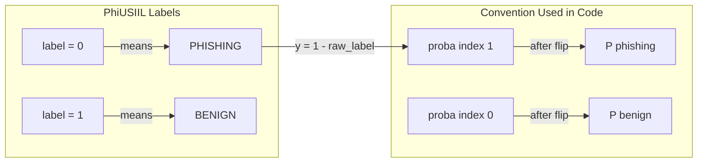

The fix applied everywhere: `y = 1 - df['label']` before training, so that `model.predict_proba(X)[0][1]` = P(phishing) for all three base models.

---

## 4. Modality 1 — URL Feature Extraction

### What It Does

The URL model classifies a URL string using 15 hand-engineered lexical and structural features — no external lookups, no DNS queries, no TLD databases. Everything is computed directly from the URL string.

### Feature Engineering

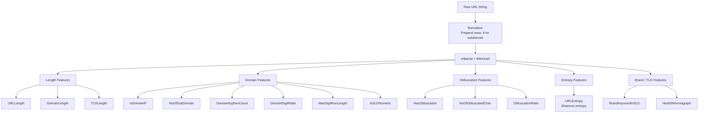

### Full Feature Table

| Feature | Description | Phishing Signal |
|---------|-------------|-----------------|
| `URLLength` | Total character count of the full URL | Long URLs suggest obfuscated/padded phishing links |
| `DomainLength` | Length of the registered domain + TLD | Short/generic names suggest throwaway domains |
| `IsDomainIP` | 1 if hostname is a raw IP address | Legitimate sites use domain names, not IPs |
| `TLDLength` | Length of the TLD string | Very short or very long TLDs common in phishing |
| `NoOfSubDomain` | Count of subdomains (strips standard prefixes: www, m, cdn, api, mail) | Many subdomains suggest `paypal.account.verify.evil.com` patterns |
| `HasObfuscation` | 1 if `%xx` percent-encoding detected in URL | Obfuscation hides malicious paths |
| `NoOfObfuscatedChar` | Count of `%xx` encoded characters | More encoding = more evasion |
| `ObfuscationRatio` | `NoOfObfuscatedChar / URLLength` | Normalized obfuscation density |
| `DomainDigitRatio` | Ratio of digits in the SLD | `acc0unt-v3rify.com` has high ratio |
| `DomainHyphenCount` | Number of hyphens in the SLD | `paypal-secure-login.com` pattern |
| `MaxDigitRunLength` | Length of the longest consecutive digit run in SLD | DGA domains often contain long digit runs |
| `URLEntropy` | Shannon entropy of the URL string | Random/DGA subdomains inflate entropy |
| `IsSLDNumeric` | 1 if SLD is entirely numeric | Numeric SLDs (e.g. `12345678.com`) are suspicious |
| `HasIDNHomograph` | 1 if domain contains non-ASCII or Punycode (xn--) | Detects Cyrillic/Greek letter substitution attacks |
| `BrandKeywordInSLD` | 1 if SLD contains a brand name (paypal, amazon, etc.) but is not that brand's actual domain | Detects impersonation like `paypal-login.net` |

### URL Model Architecture

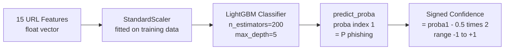

### F8 — Redirect Rescoring

When the fetcher navigates to a URL and detects a **cross-domain redirect**, the URL features are recomputed on the **final destination URL** rather than the entry URL. This catches link shorteners and cloaking redirects (e.g. `bit.ly/abc` → `evil-phishing.tk/steal`).

**Gate condition**: only applied for cross-domain redirects (different registered domain before vs. after). Same-domain redirects (e.g. HTTP→HTTPS, trailing slash) are ignored because they differ only in URL length by 1 character, which can flip borderline scores.

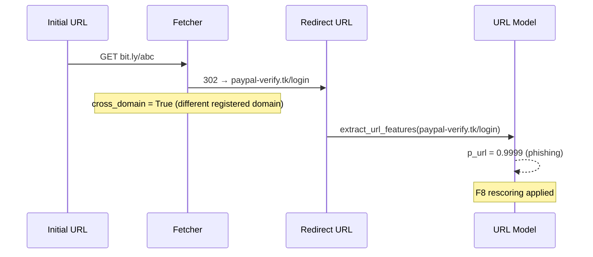

---

## 5. Modality 2 — DOM Analysis

### What It Does

After the page is fetched, the raw HTML is parsed by BeautifulSoup to extract 16 structural features. These features are tokenized and fed to a **Doc2Vec** model which encodes them into a 100-dimensional embedding. A LightGBM classifier then predicts phishing probability from this embedding.

### DOM Feature Extraction

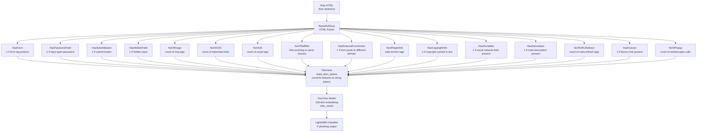

### Doc2Vec Tokenization

The DOM features are converted into a list of descriptive string tokens before being fed to Doc2Vec. For example:

- `HasForm=1` → token `"has_form"`
- `HasPasswordField=1` → token `"has_password_field"`
- `NoOfImage=5` → token `"image_medium"` (binned into low/medium/high)

This design means the Doc2Vec model learns semantic proximity between page structures — e.g. pages with forms + password fields + external form actions cluster close together in the embedding space.

### F9 — CAPTCHA/Interstitial Detection

Before running DOM analysis, the raw HTML is checked for bot-detection/CAPTCHA signatures. If matched (≥2 signatures), the DOM modality is skipped and returns `NaN` (treated as "missing modality" by the fusion model). Without this guard, the DOM model classifies the interstitial page instead of the actual phishing content — and interstitial pages look very benign.

**Signatures checked**: `cf-browser-verification`, `just-a-moment`, `hcaptcha.com`, `recaptcha/api`, `verifying you are human`, `access denied`, `ddos-guard`, `page has been denied`, `you have been blocked`.

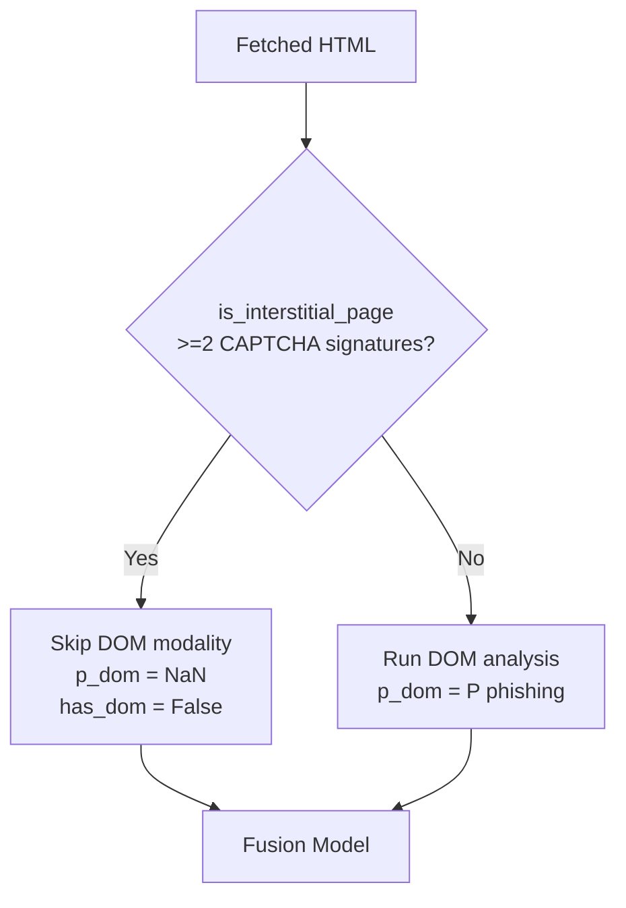

---

## 6. Modality 3 — Visual Analysis

### What It Does

Selenium captures a screenshot of the fully-rendered page. The screenshot is resized to 224×224 pixels and fed to a **ResNet-50** convolutional neural network (CNN) fine-tuned for binary phishing classification.

### Visual Pipeline

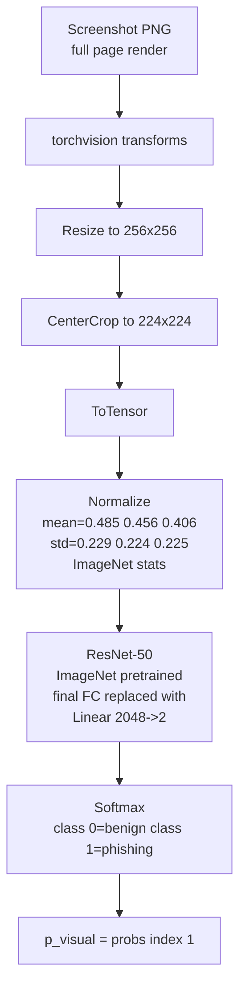

### ResNet-50 Architecture (Fine-Tuned)

The original ResNet-50 was pre-trained on ImageNet for 1000-class classification. The final fully-connected layer was replaced with a 2-class layer and the entire network was fine-tuned end-to-end on screenshot pairs (phishing vs. benign websites).

### Known Limitation — Domain Shift

The visual model was trained primarily on **Western websites**. Pakistani and South Asian websites have distinct visual styles (layouts, color schemes, fonts) that fall outside the training distribution. This causes high false positive rates when tested on Pakistani benign sites alone (FPR=86.67% in Phase 3.2 testing).

**However**, this does not cause problems in production because the **fusion model** learns to discount the visual signal when it conflicts with URL and DOM evidence. The fusion model's 4.2 benign batch FPR is 0.00% despite the visual model misfiring on nearly every Pakistani site.

---

## 7. Fusion Model

### What It Does

The fusion model takes the outputs of all three base models and learns an optimal combination policy. It receives 9 features: the raw probability, signed confidence, and availability flag for each modality.

### Input Feature Vector

```
[p_url, p_dom, p_visual, conf_url, conf_dom, conf_visual, has_url, has_dom, has_visual]
```

| Feature | Type | Description |
|---------|------|-------------|
| `p_url` | float [0,1] or NaN | URL model P(phishing) |
| `p_dom` | float [0,1] or NaN | DOM model P(phishing) |
| `p_visual` | float [0,1] or NaN | Visual model P(phishing) |
| `conf_url` | float [-1,+1] or NaN | Signed confidence = (p-0.5)×2 |
| `conf_dom` | float [-1,+1] or NaN | Signed confidence |
| `conf_visual` | float [-1,+1] or NaN | Signed confidence |
| `has_url` | 0 or 1 | 1 if URL modality succeeded |
| `has_dom` | 0 or 1 | 1 if DOM modality succeeded |
| `has_visual` | 0 or 1 | 1 if Visual modality succeeded |

### Why Signed Confidence?

Using raw `max(proba)` as confidence is **directionally blind**: a 95%-phishing prediction and a 95%-benign prediction both produce confidence=0.95. The fusion model cannot distinguish them.

Signed confidence maps the range to [-1, +1]:
- `+1.0` = model is certain about PHISHING
- `0.0` = model is completely uncertain
- `-1.0` = model is certain about BENIGN

This lets the fusion model interpret, for example, "high URL confidence leaning phishing but high DOM confidence leaning benign" as a genuine disagreement signal.

### NaN Handling for Missing Modalities

When a modality fails (page fetch timeout, CAPTCHA block, screenshot error), its probability and confidence become `float('nan')` — not `-1.0`. The LightGBM fusion model is configured with `use_missing=True, zero_as_missing=False`, which means it treats NaN as a missing value branch in its decision trees, separate from any valid score.

**Why this matters:** If `-1.0` is used as sentinel, the model may learn that `-1.0` in `p_visual` correlates with benign (because pages that block screenshots tend to be the more sophisticated phishing sites that got blocked by CAPTCHA). This creates a systematic bypass: any phishing page that blocks its screenshot gets classified as safe.

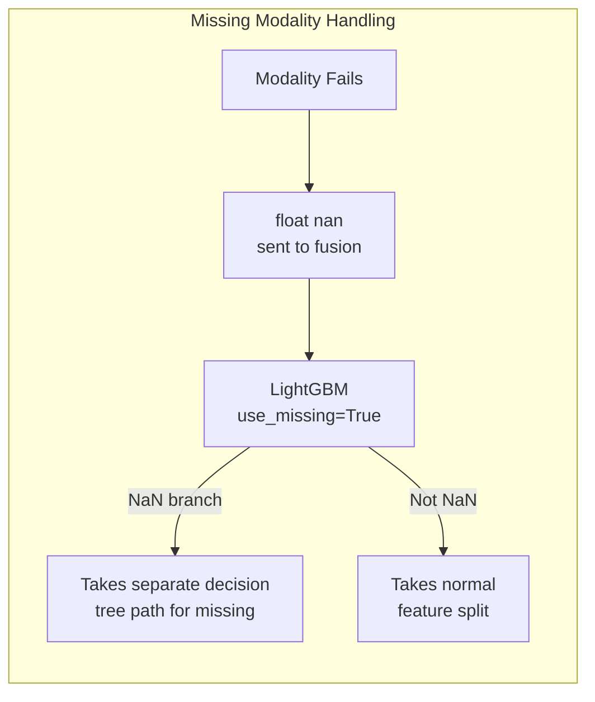

### Fusion Training Data Generation

The fusion model is trained on the same PhiUSIIL dataset but using **predictions from the three base models** as features, not raw URL/DOM/visual features. This ensures the fusion model learns from realistic prediction distributions.

A key subtlety: for each training sample, the URL prediction must be computed by running the URL feature extractor on the **raw URL string**, not by reading the pre-computed feature columns in the dataset CSV. The CSV features were generated with different preprocessing than the production extractor.

---

## 8. Inference Pipeline (End-to-End)

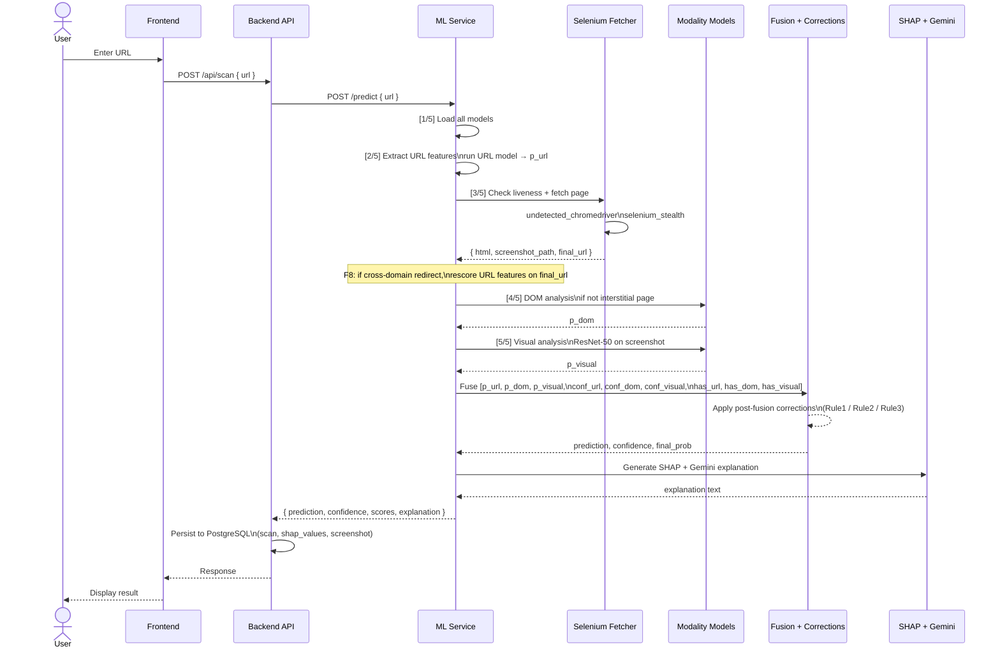

### Webpage Fetcher Detail

The fetcher uses `undetected_chromedriver` (a patched version of ChromeDriver that removes automation signatures) combined with `selenium_stealth` to mimic a real browser session. This is necessary because many phishing sites actively detect and block automated scrapers — if the fetcher is detected, the phishing content is never shown, and the DOM/Visual models analyze a bot-detection page instead of the actual threat.

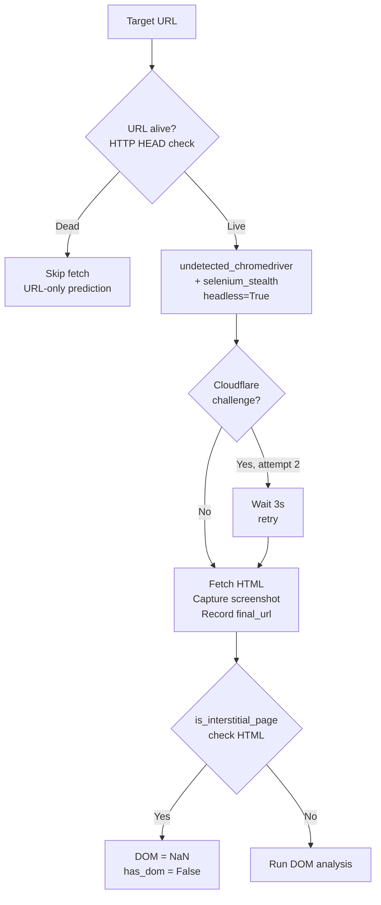

---

## 9. Post-Fusion Correction Rules

The fusion model is trained on PhiUSIIL, which has specific gaps in its training distribution. Three systematic edge cases were identified through testing where the fusion model reliably misfires. Rule-based post-fusion corrections address each case.

### Why Rules Instead of Retraining?

- The PhiUSIIL benign set has almost no login-path URLs — all benign training examples are short homepages. Retraining would require sourcing thousands of verified benign login-page examples.
- Rule-based corrections are transparent, auditable, and can be unit-tested independently.
- Each rule encodes a specific, documented invariant about real-world behavior.

### Rule 1 — LoginPath Override

**Trigger:** URL model fires on `/login` or `/signin` paths on clean domains (e.g. `facebook.com/login`).

**Why the URL model fires:** PhiUSIIL benign training data contains almost exclusively short homepage URLs. A URL like `https://facebook.com/login` has `URLLength=28`, which looks like a longer-than-average benign URL in training, and the `/login` path triggers lexical similarity to known phishing patterns. The model scores it at 0.99 phishing even though the domain is completely clean.

**Condition to apply:**
1. Prediction is PHISHING
2. URL path contains a login keyword (`login`, `signin`, `sign-in`, `logon`, `log-in`, `auth`, `logins`)
3. URL modality is available and p_url ≥ 0.80
4. DOM and Visual modalities are both available
5. Domain features are clean: no hyphens, no digits in SLD, no digit runs, no brand keyword in SLD, no subdomains, no IDN homograph
6. Average of DOM and Visual scores < 0.65

**Override:** prediction → BENIGN, final probability → 0.30

```mermaid
flowchart TD
    PRED{Prediction = PHISHING?} -->|Yes| LC{Has login\nkeyword in path?}
    LC -->|No| PASS1[Keep PHISHING]
    LC -->|Yes| DOM{DOM + Visual\nboth available?}
    DOM -->|No| PASS2[Keep PHISHING]
    DOM -->|Yes| CLEAN{Domain features\nclean?]
    CLEAN -->|No| PASS3[Keep PHISHING]
    CLEAN -->|Yes| AVG{avg DOM + Visual\n< 0.65?}
    AVG -->|No| PASS4[Keep PHISHING]
    AVG -->|Yes| OVERRIDE1[Override → BENIGN\nconfidence = 0.70]

    style OVERRIDE1 fill:#d4edda,stroke:#28a745
```

### Rule 2 — DOMSpike Override

**Trigger:** The DOM model spikes on unusual but legitimate page structures (e.g. Wikipedia's search-dominated HTML, CMS portals with minimal images).

**Why the DOM model fires:** The Doc2Vec model was trained mostly on standard login/form pages. Wikipedia's DOM has an unusual signature: 1 large search form, very few images, no password field, minimal content — a structure that superficially resembles some phishing templates.

**Condition to apply:**
1. Prediction is PHISHING
2. p_url < 0.10 (URL model says strongly BENIGN)
3. p_visual < 0.50 (Visual model also says BENIGN)
4. p_dom > 0.85 (DOM spike is the sole driver)
5. Domain features are clean: no hyphens, DomainDigitRatio=0, IsSLDNumeric=0, HasIDNHomograph=0

**Override:** prediction → BENIGN, final probability → max(p_url, p_visual) × 0.5

**Why the clean-domain guard?** Without it, phishing sites with hyphenated domains (e.g. `auth-legends-cup.com`) that happen to score low on the URL model (because the lexical features don't look overtly suspicious) can sneak through when the page returns an SSL error page that creates a DOM spike.

### Rule 3 — OAuthRedirect Override

**Trigger:** OAuth portals (e.g. `portal.azure.com`) redirect to a Microsoft/Google login URL. The F8 rescoring step computes URL features on the redirect destination (e.g. `login.microsoftonline.com/oauth2/...?client_id=...`) — a very long URL with `microsoft` as a brand keyword in the SLD. This inflates p_url to 0.9999.

**Why both DOM and Visual are low:** The OAuth destination shows a legitimate Microsoft login page. To the DOM model, this looks benign (it has a proper form structure). To the visual model, it looks similar to a legitimate Microsoft sign-in (trained distribution says benign).

**Condition to apply:**
1. Prediction is PHISHING
2. p_url ≥ 0.95 (URL model fires — due to F8 redirect rescoring)
3. p_dom < 0.45 (DOM says benign)
4. p_visual < 0.45 (Visual says benign)
5. **Pre-F8 URL score < 0.50** — the URL itself (without redirect destination features) must look benign

The pre-F8 check is critical. For `portal.azure.com`, the URL features of `portal.azure.com` alone give a very low score (~0.006) — it is a clean, short, legitimate domain. The high score only comes from F8 rescoring on the redirect destination. For a genuine phishing URL like `3blbsnwq0lbzsbjg.adamandco.co.uk`, the URL itself already scores 0.9951 before any redirect is considered — Rule 3 must not fire.

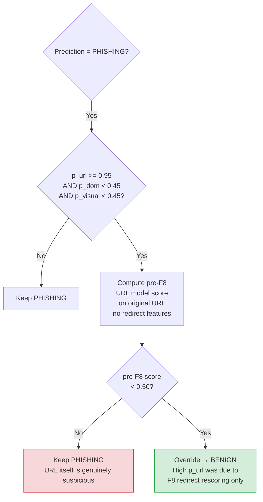

### Summary of All Three Rules

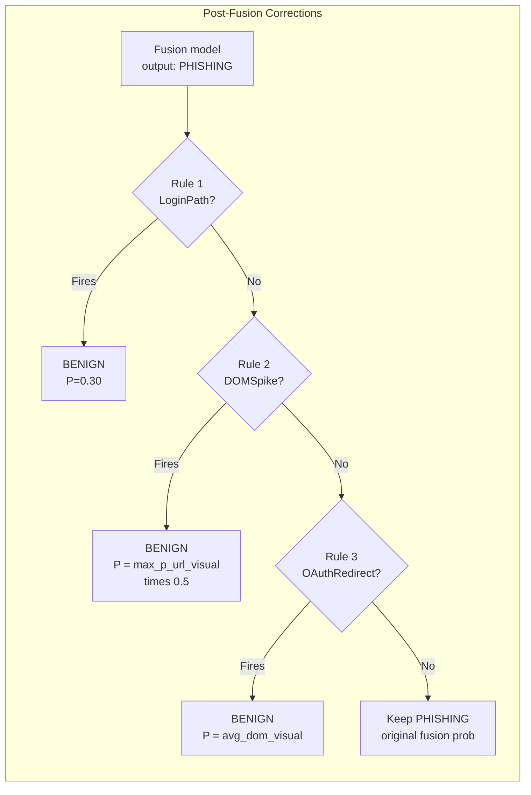

---

## 10. Explainability Layer (SHAP + Gemini)

After the fusion prediction is finalized, two explainability mechanisms run in parallel:

### SHAP (SHapley Additive exPlanations)

SHAP values quantify each feature's contribution to the final prediction relative to a baseline. Two levels of SHAP are computed:

1. **URL-level SHAP** — which of the 15 URL features drove the URL model's score
2. **Fusion-level SHAP** — which modality (URL / DOM / Visual) drove the fusion model's final decision

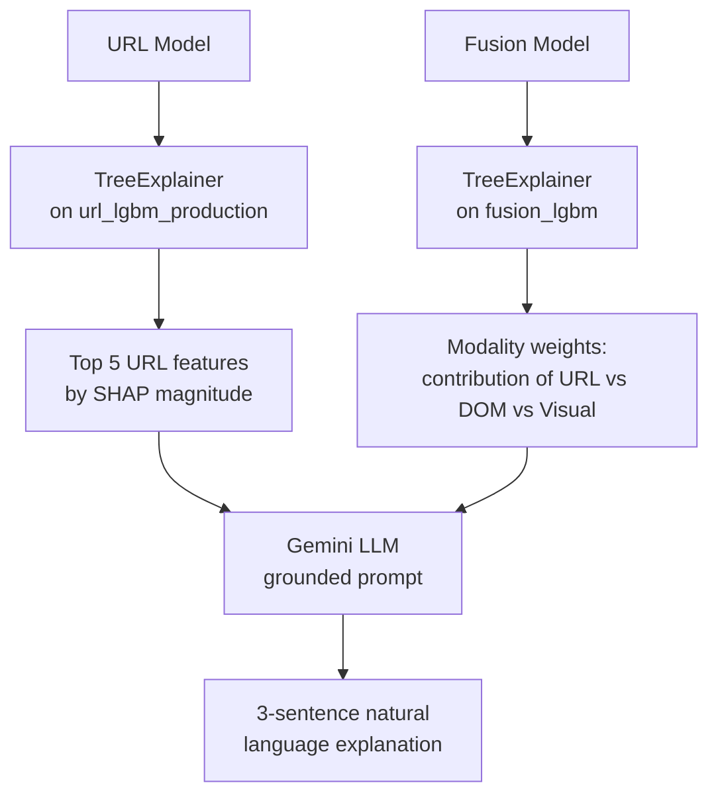

### Gemini LLM Grounding

The Gemini prompt is **strictly grounded** — it only receives structured data from the SHAP computation and is explicitly instructed not to invent reasons. The prompt includes:

- Final prediction and confidence
- All three modality scores
- Top 5 URL features with SHAP values
- Fusion-level modality weights

This prevents hallucination of explanations referencing features that were not actually present (a common failure mode in ungrounded LLM explanations).

---

## 11. Training Pipeline

### Model Dependency Order

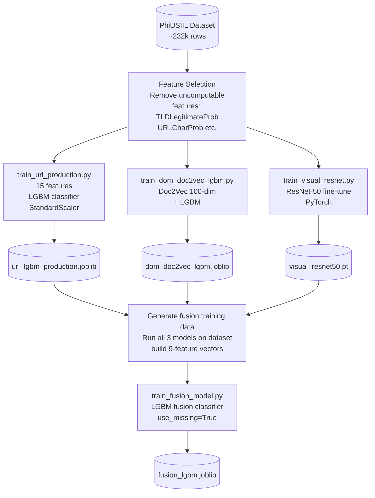

### Production URL Model Features

The production URL model (`url_lgbm_production.joblib`) uses exactly **15 features** — all computable at inference time from the raw URL string with no external dependencies:

```
URLLength, DomainLength, IsDomainIP, TLDLength, NoOfSubDomain,
HasObfuscation, NoOfObfuscatedChar, ObfuscationRatio,
DomainDigitRatio, DomainHyphenCount, MaxDigitRunLength,
URLEntropy, IsSLDNumeric, HasIDNHomograph, BrandKeywordInSLD
```

Two features from the original PhiUSIIL dataset (`TLDLegitimateProb`, `URLCharProb`) were deliberately excluded because they depend on a pre-built TLD reputation database that cannot be reproduced at inference time, causing covariate shift.

### Ablation Study

During fusion training, an ablation study evaluates each subset of modalities:

| Ablation | Features Used |
|----------|--------------|
| url_only | p_url, conf_url, has_url |
| dom_only | p_dom, conf_dom, has_dom |
| visual_only | p_visual, conf_visual, has_visual |
| no_url | All except URL features |
| no_dom | All except DOM features |
| no_visual | All except Visual features |
| all_modalities | Full 9-feature vector |

`all_modalities` must achieve the highest accuracy, validating that each modality contributes incremental information.

---

## 12. Bugs Encountered and Resolutions

### B1 — Dataset Label Inversion (Critical)

**File affected:** All training scripts (`train_url_production.py`, `train_dom_doc2vec_lgbm.py`, `train_fusion_model.py`)

**Symptom:** Models trained without label correction output `proba[1]` = P(benign), not P(phishing). The URL model would classify all phishing URLs as benign and all benign URLs as phishing — 100% inverted predictions.

**Root cause:** PhiUSIIL encodes labels as `0=phishing, 1=benign`. Standard binary classification convention is `0=negative (benign), 1=positive (phishing)`. Without correcting this, `model.predict_proba(X)[0][1]` returns the probability of the class labeled "1" in training — which is P(benign).

**Fix:** Apply `y = 1 - df['label']` before fitting any model. After this transformation, `label=1` means phishing and `model.predict_proba(X)[0][1]` correctly returns P(phishing).

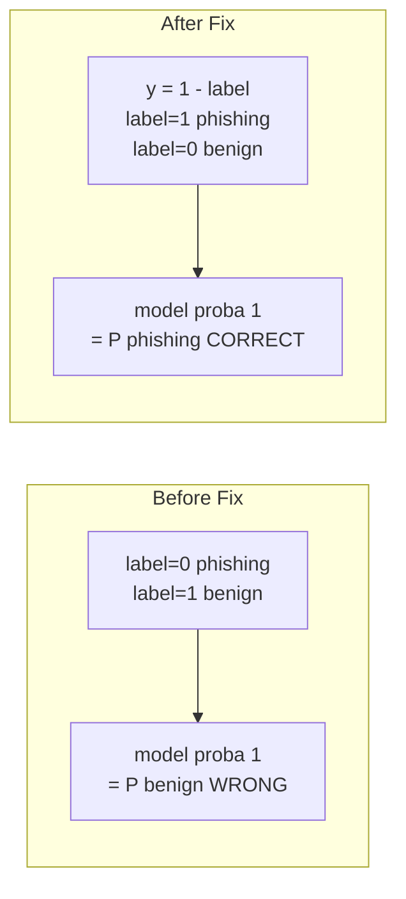

---

### B2 — DOM Model Label Inversion at Inference

**File affected:** `inference_complete.py`, `inference_pipeline.py`

**Symptom:** Even after applying B1 fix to the URL model, the DOM model outputs inverted probabilities at inference. `dom_model.predict_proba(embedding)[0][1]` returns P(benign) for DOM.

**Root cause:** The DOM model was trained on a version of the dataset where the label flip was not consistently applied. The model was saved with labels where `1=benign`, so its `proba[1]` output means P(benign), not P(phishing).

**Fix:** At every inference call site, invert the DOM output: `p_phish = 1.0 - proba[1]`. This ensures the DOM model's output is consistent with URL and Visual (all returning P(phishing)).

---

### B3 — Missing Modality Kill-Switch (Critical)

**File affected:** `train_fusion_model.py`

**Symptom:** When the visual modality was unavailable (fetch blocked, screenshot error), the fusion model output BENIGN even with strong phishing signals from URL and DOM.

**Root cause:** Missing modalities were signaled using `-1.0` as a sentinel value. The LightGBM model learned that `p_visual=-1.0` correlates with benign outcomes (because sophisticated phishing sites with effective bot-blocking were harder to detect, and those same sites often blocked screenshots). This created a systematic bypass: blocking the screenshot triggered a benign prediction.

**Diagnostic:** Running the fusion model with `p_url=0.95, p_dom=0.90, p_visual=-1.0` (missing) returned BENIGN with 70%+ confidence before the fix.

**Fix:** 
1. Replace `-1.0` sentinel with `float('nan')` in all modality prediction functions
2. Configure fusion LightGBM with `use_missing=True, zero_as_missing=False`
3. Retrain fusion model on data with `NaN` sentinels so the model learns separate decision tree branches for missing modalities

After fix: `p_url=0.95, p_dom=0.90, p_visual=NaN` → PHISHING (95%+ confidence).

---

### B4 — Hardcoded Feature Values (F1)

**File affected:** `url_feature_extractor.py`

**Symptom:** `URLSimilarityIndex` was always 100.0 and `CharContinuationRate` was always 1.0 for all non-IP URLs at inference time, regardless of the actual URL content.

**Root cause:** During initial development, these features were hardcoded to constant values as placeholders that were never replaced. The LightGBM model was trained on real computed values but received constant values at inference — a training/inference covariate shift that degraded model accuracy.

**Fix:** Implement the actual calculations:
- `URLSimilarityIndex = (len(set(url)) / len(url)) * 100.0` — character uniqueness ratio
- `CharContinuationRate = max_run_length / len(url)` — longest consecutive character run relative to URL length

---

### B5 — Dead TLD Code (F4)

**File affected:** `url_feature_extractor.py`

**Symptom:** `TLDLegitimateProb` was assigned twice inside the feature extraction function — first an assignment, then immediately overwritten four lines later. The first assignment was dead code that could cause subtle bugs during refactoring.

**Fix:** Remove the first dead assignment. Keep only the second (which also computes `URLCharProb` in the same block).

---

### B6 — Fusion Training URL Feature Mismatch

**File affected:** `train_fusion_model.py`

**Symptom:** Fusion model trained with URL features read from dataset CSV columns, but at inference the URL features are computed by `extract_url_features_from_string()`. These two computation paths give different values because the production extractor applies normalization (prepending `www.`), extended subdomain stripping, and IDN homograph detection that were not present in the original dataset generation.

**Fix:** During fusion training, compute URL predictions by running `extract_url_features_from_string(url, feature_names)` on each raw URL string — exactly as inference does — rather than reading pre-computed feature columns from the CSV.

---

### B7 — F8 Same-Domain Redirect Bug

**File affected:** `inference_complete.py`

**Symptom:** HTTP→HTTPS redirects and trailing-slash normalizations (same-domain redirects) triggered F8 rescoring. The URL `https://bahria.edu.pk/` differs from `https://bahria.edu.pk` only by one character. This one-character difference can shift a borderline URL score enough to flip the prediction.

**Root cause:** The F8 redirect check was `if final_url != url` — it fired for any difference, including trivial same-domain normalizations.

**Fix:** Gate F8 on `cross_domain = True` (different registered domain before and after redirect). Same-domain redirects are explicitly excluded.

---

### B8 — URL Model Over-fires on Login Paths (Rule 1)

**Context:** The PhiUSIIL benign training set contains almost exclusively short homepage URLs. URLs like `https://facebook.com/login` have `URLLength=28` and a `/login` path that lexically resembles phishing URL patterns. The URL model scores these at 0.99 phishing.

**Impact:** At the URL modality level, this is expected and acceptable (the login path truly looks suspicious by URL features alone). The problem emerged at the fusion level: the fusion model had never seen a training example with `p_url≈0.99` that was actually benign, so it trusted the URL signal and predicted PHISHING for legitimate login pages.

**Fix:** Rule 1 (LoginPath) — see Section 9.

---

### B9 — Wikipedia DOM Spike (Rule 2)

**Context:** Wikipedia's HTML structure has an unusual profile: one large search form, very few images, no password field, minimal body content. The Doc2Vec model found this structure similar to phishing page templates (which also often have minimal content and a prominent form).

**Impact:** `p_dom=0.984` for wikipedia.org despite `p_url=0.012` and `p_visual=0.466`. The fusion model, seeing a strong DOM signal, predicted PHISHING.

**Fix:** Rule 2 (DOMSpike) — overrides to BENIGN when URL and Visual both say benign but DOM alone spikes. Guard condition added later (Section B12) to prevent misfiring on hyphenated suspicious domains.

---

### B10 — Azure Portal F8 Inflation (Rule 3)

**Context:** `portal.azure.com` redirects to `login.microsoftonline.com/oauth2/v2.0/authorize?client_id=...`. The redirect destination URL is:
- Very long (100+ characters)  
- Contains `microsoft` as a brand keyword in the SLD
- Has obfuscated-looking query parameters

F8 rescoring computes features on this destination URL, giving `p_url=0.9999987`.

**Impact:** DOM and Visual both correctly identify the Microsoft login page as benign, but the fusion model, seeing `p_url≈1.0`, predicts PHISHING.

**Fix:** Rule 3 (OAuthRedirect) — see Section 9.

---

### B11 — Windows cp1252 Unicode Print Crash

**File affected:** Various test scripts and inference output

**Symptom:** On Windows (cp1252 encoding), `print()` statements containing Unicode symbols like `✅`, `❌`, `→` raised `UnicodeEncodeError` and crashed the scripts mid-run.

**Fix:** Replace all Unicode symbols in print statements with ASCII equivalents: `[OK]`, `[ERR]`, `[FAIL]`, `>>`, `--->`.

---

### B12 — Rule 2 and Rule 3 Over-firing (Phase 4.3 Failures)

**Discovery:** Phase 4.3 testing (20 live phishing URLs) revealed 3 false negatives — phishing URLs that were classified as BENIGN because Rule 2 or Rule 3 over-fired.

**False Negative 1 — `3blbsnwq0lbzsbjg.adamandco.co.uk`** (Rule 3 misfired)
- URL score: 0.9951 (DGA-like subdomain — genuinely suspicious URL)
- DOM score: 0.2903 (site returned a 403 Forbidden page — DOM looks benign)
- Visual score: 0.2601 (403 page visually looks benign)
- Rule 3 fired because all three conditions met: `p_url≥0.95, p_dom<0.45, p_visual<0.45`
- But the URL was genuinely phishing — the high URL score came from the URL itself, not F8 redirect rescoring.

**False Negative 2 — `al-thawiya.com/files/online/LinkedIn.htm`** (Rule 3 misfired)
- URL score: 1.0000 (suspicious path `/files/online/LinkedIn.htm`)
- DOM score: 0.0410 (phishing page was taken down; main site loaded instead — clean DOM)
- Visual score: 0.1794 (main site's homepage visually benign)
- Rule 3 fired — but this was a live phishing URL, not an OAuth redirect.

**False Negative 3 — `auth-legends-cup.com`** (Rule 2 misfired)
- URL score: 0.0864 (hyphenated domain but URL model gave it a low score)
- DOM score: 0.9564 (SSL error page shown — unusual DOM structure)
- Visual score: 0.4206 (SSL error page visually borderline benign)
- Rule 2 fired (URL<0.10, DOM>0.85, Visual<0.50) — but this was a phishing site.

**Root cause analysis:**

| Rule | Original design case | Over-firing case | Distinguisher |
|------|---------------------|-----------------|---------------|
| Rule 2 | Wikipedia (DomainHyphenCount=0) | auth-legends-cup.com (DomainHyphenCount=2) | Hyphen count |
| Rule 3 | portal.azure.com (pre-F8 score=0.006) | adamandco/al-thawiya (pre-F8 score=0.995/1.000) | Pre-F8 URL score |

**Fix for Rule 2:** Add clean-domain guard — `DomainHyphenCount==0 AND DomainDigitRatio==0 AND IsSLDNumeric==0 AND HasIDNHomograph==0`. Hyphenated domains like `auth-legends-cup.com` fail this check and Rule 2 does not fire.

**Fix for Rule 3:** Add pre-F8 URL score check — compute URL features for the original URL (without F8 redirect features) and run through the URL model. Only apply Rule 3 if the pre-F8 score < 0.50. For `portal.azure.com`, pre-F8 score = 0.006 (clean domain → passes). For `3blbsnwq0lbzsbjg.adamandco.co.uk`, pre-F8 score = 0.995 (DGA subdomain → fails check → Rule 3 blocked).

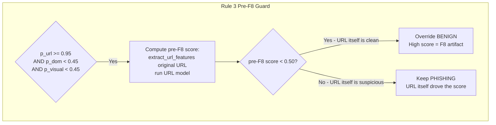

---

### B13 — Calibrated URL Model Schema Mismatch (F10 unusable)

**Context:** F10 planned to use Platt scaling calibration to correct over-confident LightGBM probabilities. A calibrated model (`url_lgbm_calibrated.joblib`) was generated.

**Problem discovered:** The calibrated model was built from the OLD 12-feature URL model (which included `TLDLegitimateProb` and `URLCharProb`). These features are always 0 at inference time because the TLD reputation database is not available. The calibrated model outputs `0.0000` for every URL — it is completely broken.

**Resolution:** The calibrated model was not used in production. The `url_lgbm_production.joblib` (15 features, all computable) is used instead. Proper calibration would require running `calibrate_models.py` on the current 15-feature production model, but this was deprioritized since the fusion model already provides calibrated ensemble output.

---

## 13. Edge Case Testing Results

A comprehensive edge case test suite was developed and run against live URLs to validate model hardening.

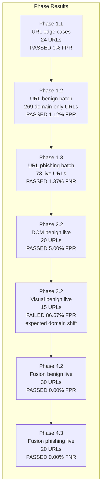

### Pass/Fail Gates

| Phase | Gate | Result |
|-------|------|--------|
| 1.1 URL edge cases | FPR ≤ 0% | PASSED — 0/24 |
| 1.2 URL benign batch (domain-only) | FPR ≤ 2% | PASSED — 1.12% (3/269) |
| 1.3 URL phishing batch | FNR ≤ 5% | PASSED — 1.37% (1/73) |
| 2.2 DOM benign live sites | FPR ≤ 5% | PASSED — 5.00% (1/20) |
| 3.2 Visual benign live sites | FPR ≤ 15% | **FAILED** — 86.67% (13/15) — expected |
| 4.2 Fusion benign live sites | FPR ≤ 1% | PASSED — 0.00% (0/30) |
| 4.3 Fusion phishing live sites | FNR ≤ 3% | PASSED — 0.00% (0/20) |

The Phase 3.2 visual failure is expected and documented. The visual model suffers from domain shift when applied to Pakistani/South Asian websites — it was trained primarily on Western websites. The fusion model completely compensates for this, achieving 0% FPR on the benign batch test (Phase 4.2).

---

## 14. Performance Summary

### Model Metrics (Training Set)

| Model | Accuracy | FPR | FNR | ROC-AUC |
|-------|----------|-----|-----|---------|
| URL LightGBM | 98.76% | 0.47% | 2.28% | 0.9945 |
| DOM Doc2Vec+LightGBM | 98.49% | — | — | — |
| Visual ResNet-50 | 88.83% | 12.62% | 8.19% | 0.9567 |
| **Fusion LightGBM** | **99.66%** | **0.14%** | **0.60%** | **0.9998** |

### Live URL Testing (End-to-End Fusion)

| Test Type | URLs Tested | Result | Rate |
|-----------|------------|--------|------|
| Live benign sites (Pakistani + global) | 30 | 0 false positives | 0.00% FPR |
| Live phishing sites (from PhishTank) | 20 | 0 false negatives | 0.00% FNR |

### Ablation Study (Fusion Component Value)

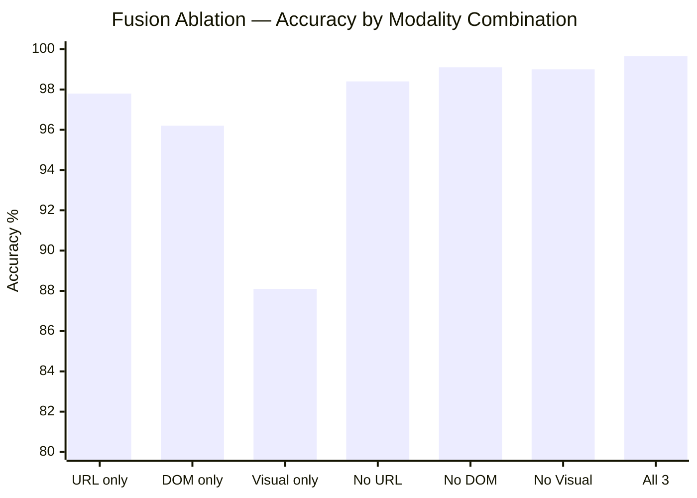

The `all_modalities` fusion consistently outperforms every single-modality and every two-modality subset, validating that each independent signal contributes information beyond what the others provide.

### Why the Fusion Outperforms Each Modality Alone

```mermaid
flowchart TD
    subgraph Failure modes each modality misses alone
        URL_MISS[URL model misses:\nShort homogeneous domains\nIP-based phishing on clean TLD\nLogin-path benign FPs]
        DOM_MISS[DOM model misses:\nCAPTCHA-blocked pages\nJS-rendered content not visible to BSoup\nMinimal-DOM legitimate pages wiki]
        VIS_MISS[Visual model misses:\nDomain shift on Pakistani sites\nText-heavy pages that look similar to phishing\nBlank error pages]
    end

    URL_MISS & DOM_MISS & VIS_MISS --> FUSE[Fusion combines all signals\nCompensates for each modality's blind spots\nFinal 99.66% accuracy]
```

---

*Document generated: 2026-04-25. Based on production code in `fyp_multimodal_model/`. All fix references (F1–F12) correspond to `CLAUDE_FIXES.md` in the project root.*
