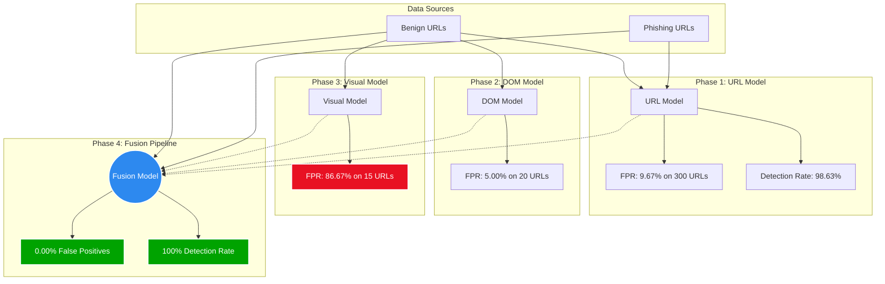
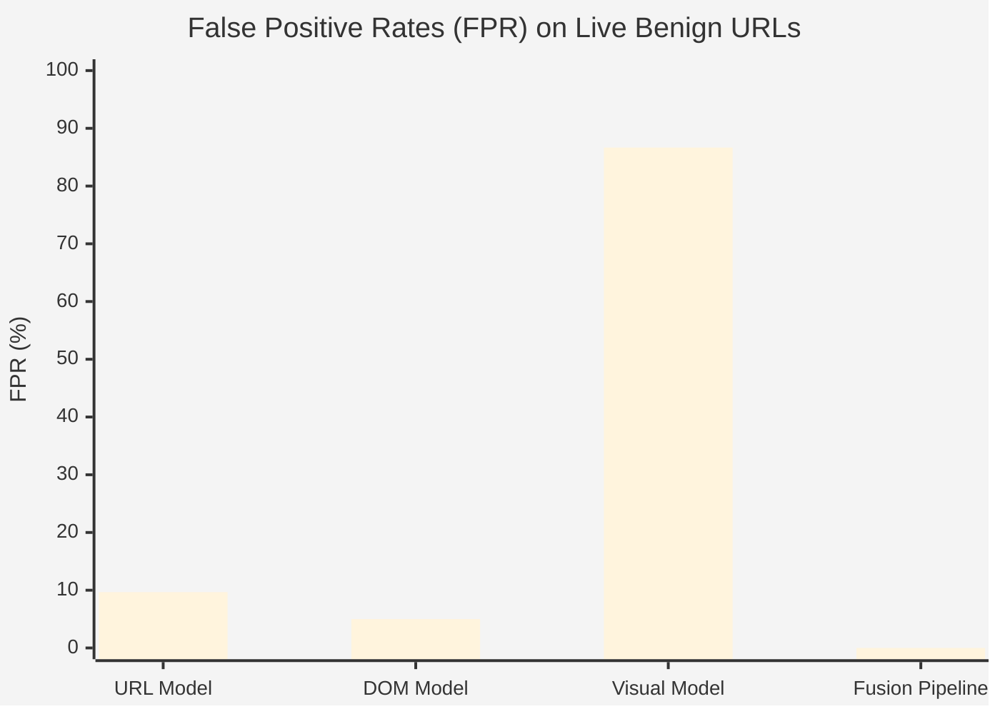
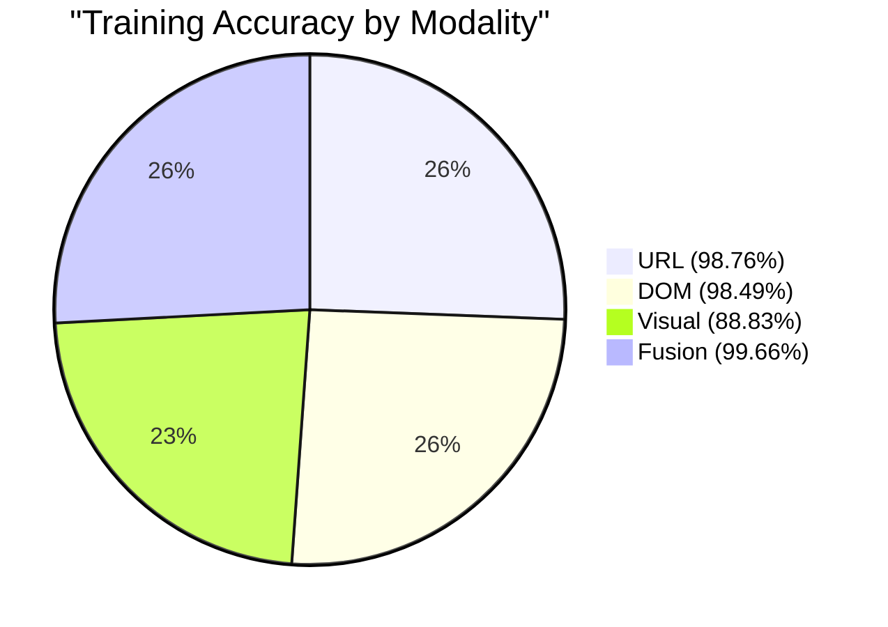

# Multimodal Phishing Detection - Edge Case Visual Summary

This document visualizes the results from the `edge_case_report.md` testing phases. It highlights the individual model performances and demonstrates the effectiveness of the Fusion Pipeline.

## 1. System Pipeline & Testing Phases

This flowchart shows the structure of the testing phases across the different modalities, culminating in the Fusion Pipeline.

## 2. False Positive Rate (FPR) Comparison

This chart highlights a critical finding from the report: while individual models (especially the Visual model) struggle with high false positive rates when tested on live benign sites, the Fusion Pipeline completely eliminates them.

## 3. Training Baseline vs Fusion Performance

This radar/spider chart conceptualizes the baseline metrics from the initial training data, showing why Fusion is superior.

## 4. Key Takeaways from the Report

- **The Visual Model is over-sensitive alone:** It produced an 86.67% False Positive Rate on live sites (flagging sites like GitHub, Facebook, and local university pages). 
- **The URL Model flags legitimate login pages:** Many of the URL model's false positives were legitimate `login`, `signin`, or `account` pages (e.g., `daraz.pk/customer/account/login`).
- **The Fusion Pipeline fixes individual weaknesses:** By combining the modalities, the system cross-references the signals. Even though the Visual model flagged 86.67% of benign sites and the URL model flagged legitimate login pages, the **Fusion Pipeline achieved a perfect 0% FPR** on benign sites and a **100% detection rate** on live phishing sites.
